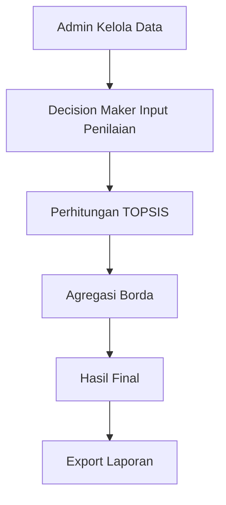

# 🏠 GDSS – Sistem Penentuan Penerima Bantuan Rumah

### TOPSIS + Borda Method

> Web-based **Group Decision Support System (GDSS)** untuk menentukan penerima bantuan rumah keluarga miskin secara objektif, transparan, dan terukur.

---

## ✨ Overview

Sistem ini membantu aparat desa dalam:

* Mengurangi subjektivitas penilaian
* Menggunakan perhitungan matematis
* Menghasilkan keputusan berbasis konsensus
* Mendokumentasikan seluruh proses seleksi

Metode yang digunakan:

* 🔢 **TOPSIS** → Penilaian individu Decision Maker
* 🗳 **Borda** → Agregasi hasil menjadi konsensus kelompok

---

## 👥 User Roles

| Role                 | Akses                             |
| -------------------- | --------------------------------- |
| 🛠 Administrator     | Kelola data, kriteria, monitoring |
| 👨‍⚖️ Decision Maker | Input penilaian                   |
| 👑 Kepala Desa       | Hitung & validasi konsensus       |

---

## 📊 Kriteria Penilaian

| Kode | Kriteria               | Tipe    |
| ---- | ---------------------- | ------- |
| C1   | Pekerjaan Orang Tua    | Cost    |
| C2   | Jumlah Tanggungan      | Benefit |
| C3   | Sumber Penghasilan     | Cost    |
| C4   | Kondisi Rumah          | Cost    |
| C5   | Status Rumah           | Cost    |
| C6   | Kepemilikan Rumah Lain | Cost    |

**Cost** → semakin kecil semakin layak
**Benefit** → semakin besar semakin layak

---

## ⚙️ Tech Stack

```bash
Backend     : PHP Native
Database    : MySQL
Frontend    : Bootstrap 5
Library     : jQuery, Chart.js
Server      : Apache (Laragon)
```

---

## 🔄 System Workflow



---

## 📈 Key Features

* ✅ Multi-user dengan RBAC
* ✅ Perhitungan TOPSIS otomatis
* ✅ Konsensus Borda
* ✅ Dashboard monitoring
* ✅ Export Excel/PDF
* ✅ Audit trail aktivitas
* ✅ Responsive UI

---

## 🏆 Study Case Result

🥇 **Fakri** – Penerima Bantuan Terpilih
🥈 Hasanah
🥉 Aminah
4️⃣ Baihaki

---

## 🗂 Database Structure

```
users
alternatif
penilaian
hasil_topsis
hasil_borda
kriteria
log_aktivitas
```

---

## 🔐 Security

* Password hashing
* Session management
* Role-based access control
* Input validation & sanitization
* SQL Injection & XSS protection

---

## 🚀 Future Development

* Integrasi data kependudukan
* Dashboard analitik
* Notifikasi real-time
* Multi-periode bantuan
* Mobile application
